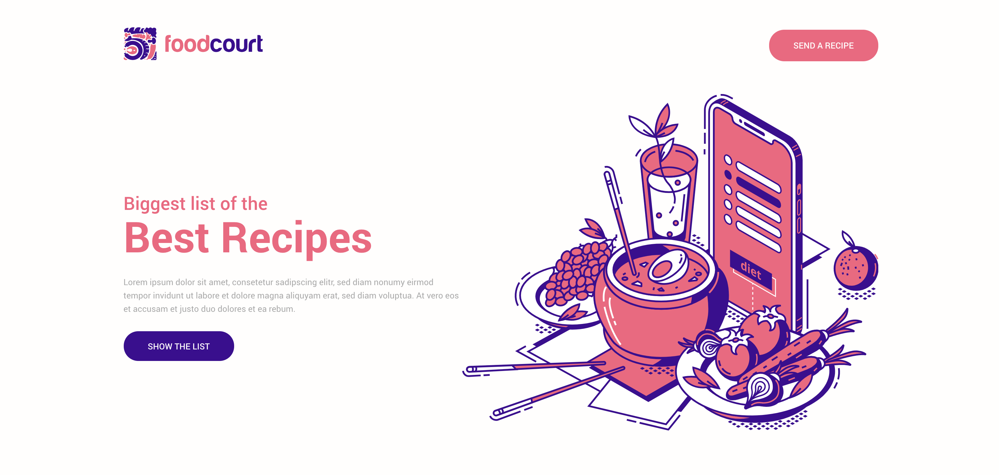
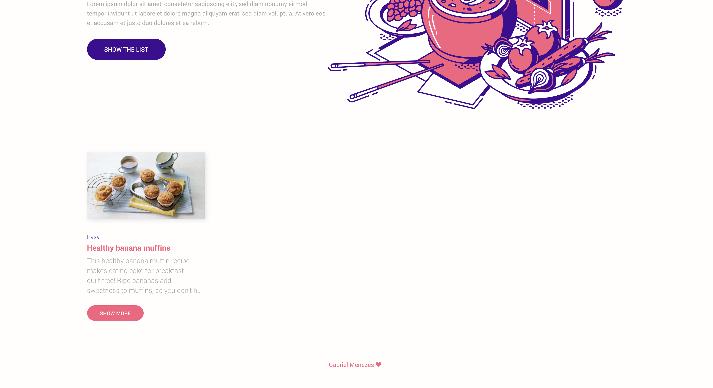
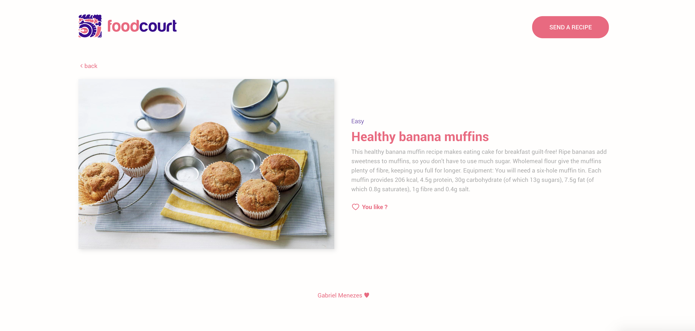
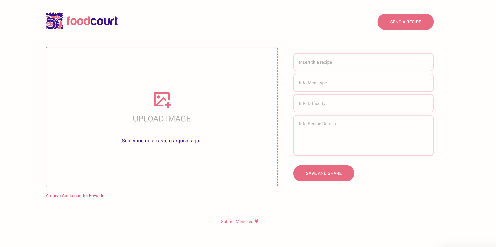

<h1 align="center">Welcome to Recipe Application 👋</h1>

<br>

<p align="center">
  
</p>

<br>

<p align= "center">
  
</p>

<p align="center">
The objective of the Recipe app is to help the user manage recipes in a way
</p>

## Demo

<p align="center">
  
</p>

<table>
 <tr>
 <td >
    
 </td>
 <td >
    
 </td>
 </tr>

  <tr>
 <td >
    
 </td>
 <td >
    
 </td>
 </tr>
</table>

## 🏠 Let's usage

### Install

```sh
yarn
```

### Usage

Create a docker container MongoDB on port **27017**.

```sh
cd server

yarn dev

cd ../web

yarn start
```

## Author

👤 **Gabriel Menezes**

- Website: https://www.linkedin.com/in/mnzs/
- Github: [@mnzsss](https://github.com/mnzsss)

## 🤝 Contributing

Contributions, issues and feature requests are welcome!<br />Feel free to check [issues page](https://github.com/mnzsss/recipe-app/issues).

## Show your support

Give a ⭐️ if this project helped you!

---

_This README was generated with ❤️ by [readme-md-generator](https://github.com/kefranabg/readme-md-generator)_
