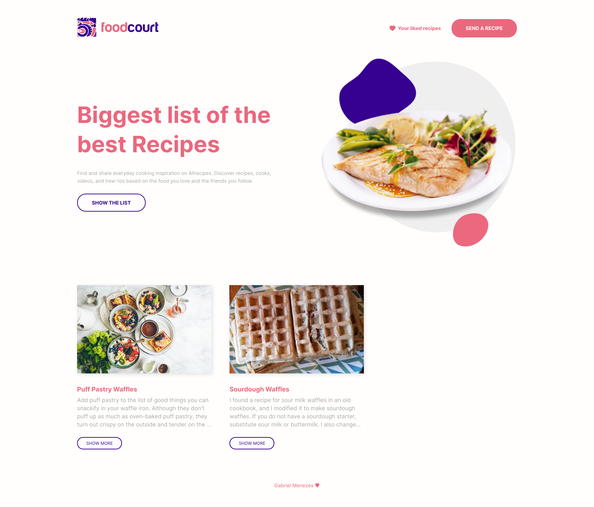
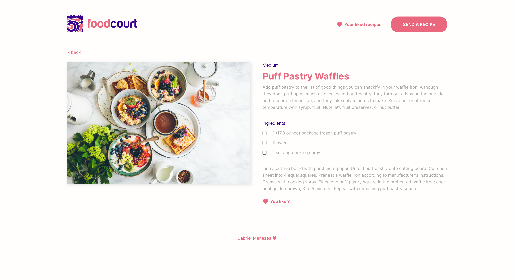
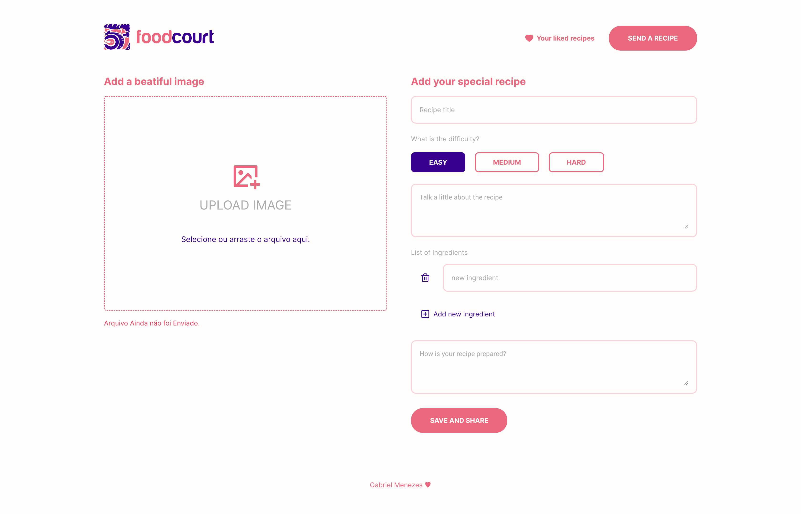
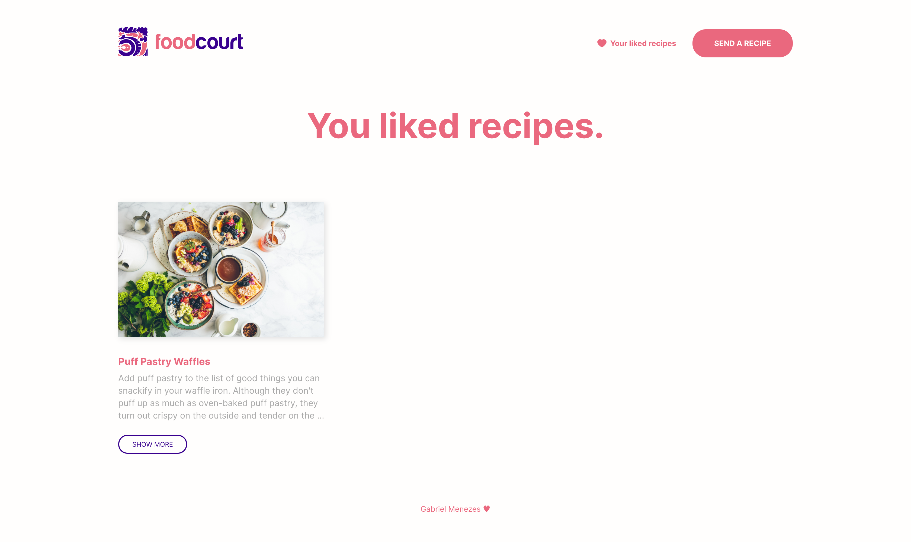

<h1 align="center">Welcome to Recipe Application 👋</h1>

<br>

<p align="center">
  
</p>

<br>

<p align= "center">
  
   
   
   
</p>

<p align="center">
The objective of the Recipe app is to help the user manage recipes in a way
</p>

## Demo

<p align="center">
   
</p>
<p align="center">

</p>

<p align="center">

</p>

<p align="center">

</p>

## 🏠 Let's usage

### Install

```sh
# Setup Server
cd ../server

# Copy and rename .env.example to .env
# Add your MONGO_URL to .env (you get url on MongoDB Atlas)

# Install dependecies
yarn

# Setup Web
cd ../web

# Install dependecies
yarn
```

### Usage


```sh
# Clone Project
git clone https://github.com/mnzsss/recipe-app.git

# Setup run Server
cd ../server

# Run Server
yarn dev:server

# Setup run Web
cd ../web

# Run Web Application
yarn start
```

### 🤔 How to contribute?

**Fork this Repository**

```bash
# Use github CLI:
$ gh repo fork mnzsss/recipe-app

# If you don't have a GitHub CLI, use the website for this.
```

**Follow the steps below**

```bash
# Clone your fork
$ git clone your-fork-url && cd recipe-app

# Create branch
$ git checkout -b feat/my-feature

# Create commit
$ git commit -m 'feat: My new feature'

# Send code to repository
$ git push origin my-feature
```

After your pull request is merged, you can delete your branch.

## Author

👤 **Gabriel Menezes**

- Website: https://www.linkedin.com/in/mnzs/
- Github: [@mnzsss](https://github.com/mnzsss)

## 🤝 Contributing

Contributions, issues and feature requests are welcome!<br />Feel free to check [issues page](https://github.com/mnzsss/recipe-app/issues).

## Show your support

Give a ⭐️ if this project helped you!

---

_This README was generated with ❤️ by [readme-md-generator](https://github.com/kefranabg/readme-md-generator)_
